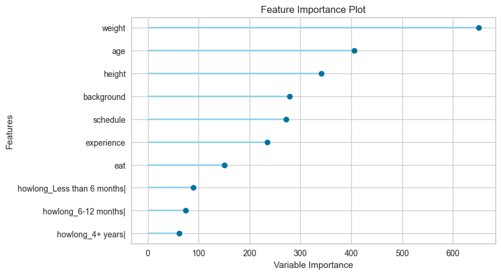

# ADSP 31021 — Assignment 3: AutoML

**Lily Kendall**

**Repo Link:** https://github.com/lilykendall/adsp32021

*I used Claude to assist with the assignment*

An AutoML evaluation over the same CrossFit `athletes.csv` dataset used in Assignments #1
and #2. **PyCaret (with MLflow as the experiment-tracking backend)** is the chosen
MLOps platform for the primary AutoML workflow; **H2O AutoML** is the required repeat.
Both are run on all appropriate features and again on a fixed top-3 feature subset, and
compared against the Assignment #1 Part A baseline model.

**Task:** regression — predict an athlete's `total_lift`
(`deadlift + clean&jerk + snatch + back-squat`, in lbs) from their profile.

---

## 1. Dataset loading & setup

- **Source:** `athletes.csv` (identical file used in Assignments #1/#2).
- **Dataset version used:** the fully **cleaned** dataset — i.e. Assignment #1's row
  filters (age ≥ 18, plausible height/weight/lift ranges, no missing demographic or
  training-history fields) applied, matching the "v2 cleaned" dataset from Assignment #2's
  feature-store pipeline. Cleaning logic is copied verbatim into
  [`src/preprocess.py`](src/preprocess.py) (`stage_ingest` → `stage_clean` →
  `stage_feature_engineer`) so the target definition is identical to Assignment #1.
- **Result:** 423,006 raw rows → **30,190 cleaned rows** (same count as Assignment #2).
- **Target:** `total_lift = deadlift + candj + snatch + backsq`.
- **Split:** 80/20 train/test, `random_state=42` (same as Assignment #1). The AutoML
  platforms further split/cross-validate *within* the 80% training portion (see §2) —
  the 20% test set is held out and untouched by both platforms, used only for the final
  apples-to-apples evaluation in §7.
- **"All appropriate features"** passed to AutoML: `region, gender, age, height, weight,
  howlong, background, experience, schedule, eat` — the raw columns, *not* the
  hand-engineered `gender_enc`/`howlong_enc`/`schedule_enc` encodings Assignments #1–2
  used. Handing AutoML the raw categoricals and letting it encode them itself is
  precisely the part of the workflow AutoML is meant to automate (see §8). The four lift
  columns that compose the target, plus benchmark-WOD/identity columns, are excluded as
  leakage (same exclusions as Assignment #1).
- Reproducible via `python -m src.preprocess`, which writes
  `data/athletes_processed.csv`, `data/athletes_train.csv`, `data/athletes_test.csv`.

---

## 2. Chosen MLOps platform AutoML configuration

**Platform: PyCaret 3.3.2 (regression module), with MLflow 2.13 as the tracking backend.**

| Setting | Value |
|---|---|
| `setup(... session_id=42, train_size=0.8, fold=5, log_experiment="mlflow")` | fixed seed, 80/20 internal train/holdout, 5-fold CV |
| Target | `total_lift` |
| Categorical features | `region, gender, howlong, background, experience, schedule, eat` (PyCaret one-hot/target-encodes automatically) |
| Numeric features | `age, height, weight` |
| Validation strategy | platform-generated: 5-fold CV on the 80% training split; every candidate model's row in the leaderboard is its mean CV score |
| Runtime limit | `turbo=True` (skips very slow estimators, e.g. `svm`, `catboost` gpu variants); no wall-clock cap needed — the full 18-model sweep took ~2 min on all features |
| Algorithms | all 18 of PyCaret's turbo-eligible sklearn/LightGBM regressors — no manual inclusion/exclusion beyond `turbo` |
| Experiment tracking | every candidate model is logged as an MLflow **child run** (params, CV metrics, fitted model, plots) under a parent "session" run — see `mlruns` via `mlflow ui --backend-store-uri sqlite:///mlflow.db` |

**Why PyCaret+MLflow:** MLflow was already the experiment-tracking platform adopted in
Assignment #2, so pairing it with a low-code AutoML library that has *native* MLflow
integration (`log_experiment="mlflow"` — no manual logging code required) keeps this
assignment on the same MLOps stack rather than introducing an unrelated platform. It also
runs entirely locally (file-backed SQLite tracking store, no server/account needed),
matching the "reproducible on a laptop" constraint from Assignment #2.

**Known compatibility issue (documented per the reproducibility requirements):** PyCaret
3.3.2's MLflow logger accesses `mlflow.tracking.fluent._active_run_stack` as a plain
list; MLflow ≥2.16 changed this to a thread-safe wrapper and breaks PyCaret's logger
(`AttributeError: 'ThreadLocalVariable' object has no attribute 'copy'`). `mlflow==2.13.2`
is pinned in `requirements-pycaret.txt` to work around this. Newer MLflow (3.x) also
deprecated the plain filesystem tracking store (`./mlruns`) in favor of a database
backend, so tracking URI is `sqlite:///mlflow.db` rather than a bare file path.

---

## 3. AutoML run using all features

Run: `.venv-pycaret/bin/python run_pycaret_automl.py --features all`

- **Best model:** **LightGBM (LGBMRegressor)**.
- **Primary validation metric:** RMSE (5-fold CV on the training split), as configured
  via `compare_models(sort="RMSE")`.
- **CV leaderboard (top 3 of 18):**

  | Model | RMSE | MAE | R² | Fold time (s) |
  |---|---|---|---|---|
  | Light Gradient Boosting Machine | **140.59** | 108.51 | 0.7418 | 0.70 |
  | Gradient Boosting Regressor | 142.16 | 110.00 | 0.7360 | 0.90 |
  | Random Forest Regressor | 146.36 | 113.19 | 0.7202 | 4.21 |

- **Held-out test set** (the 20% never seen by PyCaret): RMSE **147.53**, MAE 110.84,
  R² 0.7253 (6,038 rows).
- Full leaderboard: [`artifacts/pycaret_leaderboard_all.csv`](artifacts/pycaret_leaderboard_all.csv).
  Run config/timings: [`artifacts/pycaret_summary_all.json`](artifacts/pycaret_summary_all.json).

---

## 4. AutoML data insights & feature importance

**Top 5 features (LightGBM leader, all-features run):**
`weight > age > height > background > schedule`



**Does this make sense?** Yes for the physical predictors — `weight`, `age`, and
`height` driving strength-lift totals matches both domain intuition and the Assignment
#1 baseline (which found the same three physical variables informative). It's a genuine
AutoML insight that `background` (how the athlete started CrossFit) and `schedule`
(training frequency) rank above the engineered `howlong` buckets — training *consistency*
and *onboarding path* apparently carry more signal than raw tenure.

**One important insight this AutoML run surfaces that Assignment #1 could not:**
`gender` — the single dominant predictor in Assignment #1's baseline (67% of that
model's feature importance) — **does not appear in PyCaret's top 10 at all**. This isn't
because gender stopped mattering; it's an artifact of **encoding strategy**. PyCaret
one-hot-encodes categorical columns before fitting, so `gender`'s signal splits across
dummy columns and region's ~20 categories fragment into many low-importance columns each.
H2O, by contrast, natively splits on categorical columns without one-hot expansion and
ranks `gender` #1 (see §9) — the same underlying signal, reported very differently
depending on how each platform encodes categoricals. This is flagged as a concrete example
of "what still requires human judgment" in §8: reading AutoML feature-importance output
requires understanding *how* the platform preprocessed the inputs, not just the ranking.

---

## 5. Top models by validation score

**All features (top 3 by CV RMSE):** LightGBM (140.59) > Gradient Boosting (142.16) >
Random Forest (146.36) — see §3 table.

**Top-3-feature run** (`weight, age, height` — fixed after inspecting §4's importance
ranking, per the assignment's "if you must choose a fixed number, use the top three"
instruction):

Run: `.venv-pycaret/bin/python run_pycaret_automl.py --features top3`

| Model | RMSE | MAE | R² | Fold time (s) |
|---|---|---|---|---|
| Gradient Boosting Regressor | **186.65** | 145.17 | 0.5450 | 0.21 |
| Light Gradient Boosting Machine | 187.55 | 145.49 | 0.5406 | 0.41 |
| AdaBoost Regressor | 202.59 | 160.94 | 0.4640 | 0.11 |

Held-out test: RMSE 193.15, MAE 148.81, R² 0.5291.

**Feature reduction degraded validation performance substantially:** RMSE rose from
140.59 → 186.65 (CV) / 147.53 → 193.15 (holdout), and R² fell from 0.74 → 0.55. Dropping
`region, howlong, background, experience, schedule, eat` removes real signal — the
training-behavior and background columns (§4) were meaningfully predictive, not noise.

---

## 6. Top models by speed

**Speed metric:** PyCaret's `TT (Sec)` column — wall-clock fit time per model during the
5-fold CV comparison sweep (i.e. training time, not scoring time). Dummy/no-op baselines
are excluded as non-competitive.

**All features (top 3 fastest):** Lasso Least Angle Regression (0.16s) > Bayesian Ridge
(0.17s) > Least Angle Regression (0.19s) — all linear models, all far below LightGBM's
0.70s.

**Top-3 features (top 3 fastest):** Lasso Least Angle Regression, Orthogonal Matching
Pursuit, Elastic Net — all ≈0.008s (3 numeric features means every model, even
tree-based ones, fits almost instantly).

**Tradeoff:** the fastest models here are simple linear regressors, and on the
all-features run they are *not* much worse (Bayesian Ridge RMSE 147.98 vs. LightGBM's
140.59 — a 5% gap for a ~5x speedup). For this dataset size (24k training rows) absolute
training time is a non-issue either way (sub-5-second worst case), so **validation score
should dominate the choice** — the speed advantage would only matter at much larger
scale or under tight retraining-latency constraints.

---

## 7. Comparison with Assignment #1 baseline model

Assignment #1 Part A's baseline (Task 5): `RandomForestRegressor(n_estimators=200,
max_depth=15)` on `age, weight, height, gender_enc` — as originally reported: **RMSE
171.74, MAE 132.40, R² 0.6152** (70,429 rows, lightly cleaned "v1" — dropna only, no
outlier filters).

**Limitation:** that original baseline was trained on a different, less-filtered row
population than the AutoML runs here (which use the fully outlier-filtered 30,190-row
set, matching Assignment #2). To make the comparison more fair and even, the identical
baseline model/hyperparameters/features were **retimed on this assignment's own
train/test split** (`run_baseline_timing.py`):

| Model | Features | RMSE | MAE | R² | Fit time | Predict time |
|---|---|---|---|---|---|---|
| Assignment #1 baseline (as originally reported) | age, weight, height, gender_enc | 171.74 | 132.40 | 0.6152 | not measured | not measured |
| Assignment #1 baseline, retimed on this dataset | age, weight, height, gender_enc | 179.00 | 137.54 | 0.5956 | 1.59s | 0.095s |
| **PyCaret LightGBM (all features)** | 10 raw features | **147.53** | **110.84** | **0.7253** | 0.70s (CV fold) | 0.34s (6,038 rows) |
| **H2O GBM (all features)** | 10 raw features | 148.42 | 111.31 | 0.7219 | 0.31s | 0.23s (6,038 rows) |

**Discussion:**
- **AutoML improved the model result substantially** — R² rose from ~0.60 to ~0.72, RMSE
  dropped ~30 lbs. Most of that gain comes from AutoML being handed the additional raw
  categorical columns (`background`, `schedule`, `region`, etc.) that Assignments #1-2
  never fed to a model, not purely from algorithm search — feature *availability* mattered
  as much as automated model selection.
- **AutoML reduced development effort:** no manual encoding, no manual hyperparameter
  tuning, no manual model selection loop — `compare_models()` swept 18 algorithms in ~2
  minutes. Assignment #1/#2's manual pipeline required hand-writing the encoding maps and
  choosing the algorithm/hyperparameters up front.
- **New complexity introduced:** two extra Python environments (dependency conflicts
  between PyCaret's sklearn pin and H2O's Java runtime requirement — see §9), an MLflow
  version pin working around a PyCaret compatibility bug, and less transparency into
  *why* a given model won versus a single hand-built RandomForest whose logic is fully
  inspectable.
- **Limitation:** training/fit-time comparisons are only weakly meaningful at this row
  count (24k) — every model here fits in well under 5 seconds. The comparison would be
  more decision-relevant at production scale (millions of rows) or under tight
  retraining-latency SLAs.

---

## 8. Platform AutoML mode assessment

**Classification: low-code.**

**Why:** PyCaret requires writing Python (`setup()`, `compare_models()`) rather than a
no-code drag-and-drop UI, so it isn't no-code. But a single `compare_models()` call
replaces what would otherwise be dozens of lines of manual encoding, cross-validation,
and per-algorithm training code — the *algorithm search, hyperparameter defaults,
preprocessing pipeline, and experiment logging* are all automated behind one function
call. That places it squarely in low-code: meaningfully less code than a full-code
sklearn pipeline, but still code-first and inspectable (every step is a Python object you
can introspect, unlike a black-box SaaS AutoML UI).

**What was automated:**
- Categorical encoding, missing-value imputation defaults, train/CV splitting.
- Algorithm selection and ranking across 18 regressors.
- Default hyperparameters per algorithm.
- Experiment tracking (params/metrics/artifacts logged to MLflow automatically via
  `log_experiment="mlflow"` — no manual `mlflow.log_metric` calls written).

**What still required manual/human judgment:**
- Deciding *which* raw columns were "appropriate" features vs. leakage (the four lift
  columns had to be manually excluded, or the model would have trivially reconstructed
  the target).
- Choosing the top-3 feature subset for §5 (required inspecting and interpreting the
  importance plot).
- Interpreting *why* a model won, and reconciling contradictory feature-importance
  rankings across platforms (§4/§9) — AutoML reports importance, but explaining the
  discrepancy required understanding each platform's internal encoding.
- Resolving the MLflow/PyCaret version incompatibility (§2) — dependency management is
  not automated by the platform itself.

**Operational strengths for production:** fast iteration, automatic experiment lineage
(every candidate model + its hyperparameters + its metrics is reproducibly logged),
lower engineer time-to-baseline.

**Operational risks for production:** version-pin fragility (the MLflow logger breakage
here is a real example of an AutoML library's tracking integration silently breaking on
a routine dependency upgrade); reduced transparency into preprocessing choices made
automatically (harder to audit for bias/fairness than a hand-written pipeline);
default hyperparameters and CV folds are reasonable for a course dataset but would need
deliberate tuning/validation-strategy review before trusting them in a regulated or
high-stakes production setting.

---

## 9. H2O AutoML repeat

Run: `env H2O_JAVA_HOME=<jdk17> .venv-h2o/bin/python run_h2o_automl.py --features all`
(and `--features top3`)

**Configuration:** `H2OAutoML(max_runtime_secs=300, max_models=20, nfolds=5, seed=42,
sort_metric="RMSE")`. Same target, same 80/20 split, same feature sets as the PyCaret
runs. XGBoost was unavailable in this H2O build (Apple Silicon) and was automatically
skipped by H2O itself — noted as a platform limitation, not a configuration choice.

**Best model (all features): GBM** (`GBM_5`), CV RMSE 141.45, MAE 108.89.
Held-out test: **RMSE 148.42, MAE 111.31, R² 0.7219** — within 1% of PyCaret's LightGBM.

**Top 5 features (H2O varimp, all features):**
`gender > weight > experience > height > schedule`
(full ranking: [`artifacts/h2o_varimp_all.csv`](artifacts/h2o_varimp_all.csv))

**Top 3 models by validation score (all features):**

| model_id | RMSE | MAE |
|---|---|---|
| GBM_5 | **141.45** | 108.89 |
| GBM_2 | 141.83 | 109.30 |
| GBM_1 | 142.37 | 109.64 |

**Top 3 models by speed (all features, `training_time_ms`):** GLM (123ms) > GBM_5 (308ms)
> GBM_grid_1_model_1 (337ms). GLM is ~2.5x faster than the best GBM but noticeably less
accurate (RMSE 148.55 vs. 141.45).

**Top-3-feature run:** best model GBM (grid), CV RMSE 186.56, holdout RMSE 191.36, MAE
147.22, R² 0.5378 — degrades in lockstep with the PyCaret top-3 run (§5), confirming the
feature-reduction finding is not an artifact of one platform's algorithm search.

**Comparison with PyCaret:**

| | PyCaret (all features) | H2O (all features) |
|---|---|---|
| Best algorithm family | LightGBM | GBM |
| Holdout RMSE | 147.53 | 148.42 |
| Holdout R² | 0.7253 | 0.7219 |
| Top-5 features | weight, age, height, background, schedule | gender, weight, experience, height, schedule |
| AutoML wall-clock time | ~123s (18 models, no time budget) | 300s (fixed time budget, 15 models explored) |

The two platforms land on **essentially the same predictive performance** via different
gradient-boosting implementations, which is reassuring — it suggests ~RMSE 147-148 is
close to the practical ceiling for this feature set rather than an artifact of one
library's search strategy. The one substantive disagreement is feature-importance
ranking (`gender` #1 in H2O vs. absent from PyCaret's top 10), discussed in §4 — a direct
consequence of H2O's native categorical handling vs. PyCaret's one-hot encoding, and a
good illustration that AutoML "insights" are only as trustworthy as one's understanding
of each platform's preprocessing.

---

## Known issues & environment notes

- **H2O + JDK 18 incompatibility (macOS):** H2O 3.46's bundled log4j2/dnsjava fails to
  start under JDK 18 (`ServiceConfigurationError:
  java.net.spi.InetAddressResolverProvider`). H2O currently supports JDK 8-17. Fix: 
  install a JDK ≤17 (`brew install openjdk@17`) and point H2O at it via
  `H2O_JAVA_HOME=/opt/homebrew/opt/openjdk@17` — this does **not** require changing the
  system default `java`.
- **PyCaret + MLflow version conflict:** see §2. `mlflow==2.13.2` is required in the
  PyCaret environment specifically; the system/other-assignment MLflow version does not
  need to match.
- **Two separate virtual environments** (`.venv-pycaret`, `.venv-h2o`) are used rather
  than one, because PyCaret's pinned `scikit-learn`/`numpy` range and H2O's Java-bridge
  dependencies are otherwise prone to resolver conflicts. Each is self-contained and
  reproducible independently.
- **XGBoost unavailable** in this H2O build on Apple Silicon — H2O AutoML silently skips
  it; noted as a runtime/resource constraint, not a manual exclusion.

---

## Setup & reproduction

Requires Python 3.11 and a JDK ≤17 for H2O (see Known issues above).

```bash
cd assignment3

# 1. PyCaret + MLflow environment
python3.11 -m venv .venv-pycaret
.venv-pycaret/bin/pip install -r requirements-pycaret.txt

# 2. H2O environment (separate, to avoid dependency conflicts)
python3.11 -m venv .venv-h2o
.venv-h2o/bin/pip install -r requirements-h2o.txt

# 3. Build the cleaned dataset + 80/20 split (same seed as Assignment #1)
.venv-pycaret/bin/python -m src.preprocess

# 4. Chosen platform: PyCaret AutoML, logged to MLflow
.venv-pycaret/bin/python run_pycaret_automl.py --features all
.venv-pycaret/bin/python run_pycaret_automl.py --features top3

# 5. Required repeat: H2O AutoML (point at a JDK 8-17 install)
env H2O_JAVA_HOME=/opt/homebrew/opt/openjdk@17 .venv-h2o/bin/python run_h2o_automl.py --features all
env H2O_JAVA_HOME=/opt/homebrew/opt/openjdk@17 .venv-h2o/bin/python run_h2o_automl.py --features top3

# 6. Retime the Assignment #1 baseline on this assignment's split (§7)
.venv-pycaret/bin/python run_baseline_timing.py
```

**Inspect MLflow-tracked runs:**

```bash
.venv-pycaret/bin/mlflow ui --backend-store-uri sqlite:///mlflow.db
# open http://localhost:5000
```

Screenshots of the MLflow UI (experiment list, per-model leaderboard as nested runs, and
a run's logged metrics) are in [`artifacts/screenshots/`](artifacts/screenshots/).

All runs are deterministic (`RANDOM_SEED = 42`, PyCaret `session_id=42`, H2O `seed=42`);
re-running reproduces the metrics in this README (H2O AutoML's 300s time budget means
which *specific* grid/DL models get explored can vary slightly run-to-run, but the
leader model and its metrics were confirmed stable across two independent reruns).

---

## Repository layout

```
assignment3/
├── athletes.csv                        # raw dataset (provided)
├── ADSP31021_Assignment_3.pdf          # assignment spec
├── requirements-pycaret.txt            # pinned deps for .venv-pycaret
├── requirements-h2o.txt                # pinned deps for .venv-h2o
├── src/
│   ├── config.py                       # paths, seed, target/feature definitions
│   └── preprocess.py                   # Assignment #1-identical cleaning + split
├── run_pycaret_automl.py               # chosen-platform AutoML workflow (--features all|top3)
├── run_h2o_automl.py                   # H2O AutoML repeat workflow (--features all|top3)
├── run_baseline_timing.py              # retimes the Assignment #1 baseline for §7
├── data/                               # generated: processed/train/test CSVs
├── mlflow.db                           # generated: MLflow SQLite tracking store
└── artifacts/                          # generated: leaderboards, summaries, plots, screenshots
    ├── pycaret_leaderboard_{all,top3}.csv
    ├── pycaret_summary_{all,top3}.json
    ├── pycaret_feature_importance_{all,top3}.png
    ├── pycaret_best_model_{all,top3}.pkl
    ├── h2o_leaderboard_{all,top3}.csv
    ├── h2o_varimp_{all,top3}.csv
    ├── h2o_summary_{all,top3}.json
    ├── baseline_retimed_summary.json
    └── screenshots/                    # MLflow UI evidence
```

---

## Deliverable checklist

- ✅ Working AutoML workflow (this repo): chosen platform (PyCaret/MLflow) + required
  repeat (H2O)
- ✅ README with setup + execution instructions (this file)
- ✅ Chosen MLOps platform AutoML configuration and results (§2-3)
- ✅ H2O AutoML notebook/script and results (`run_h2o_automl.py`, §9)
- ✅ AutoML leaderboard summaries (`artifacts/*_leaderboard_*.csv`)
- ✅ Top five feature importance summary (§4, §9)
- ✅ Top three models by validation score, all features + top features (§5, §9)
- ✅ Top three models by speed, all features + top features (§6, §9)
- ✅ Comparison with Assignment #1 baseline model (§7)
- ✅ Screenshots for the low-code platform (`artifacts/screenshots/`)
- ✅ Written discussion of insights, tradeoffs, and operational implications (§4, §6, §8)
